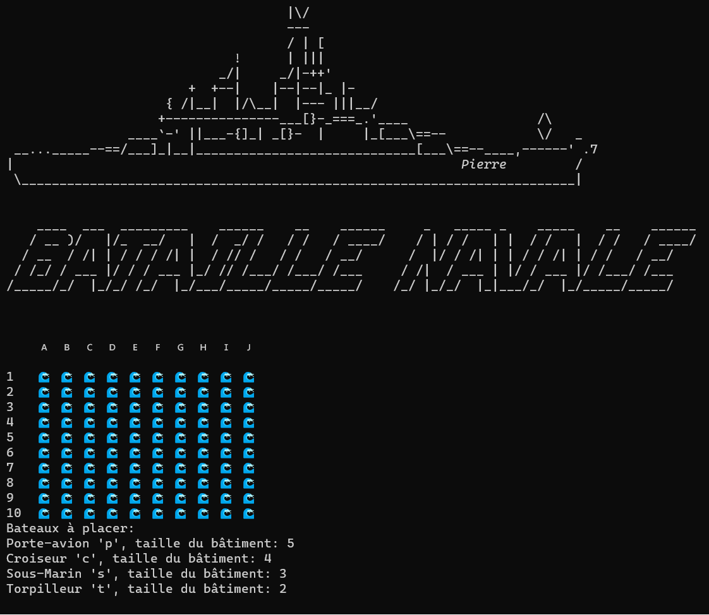
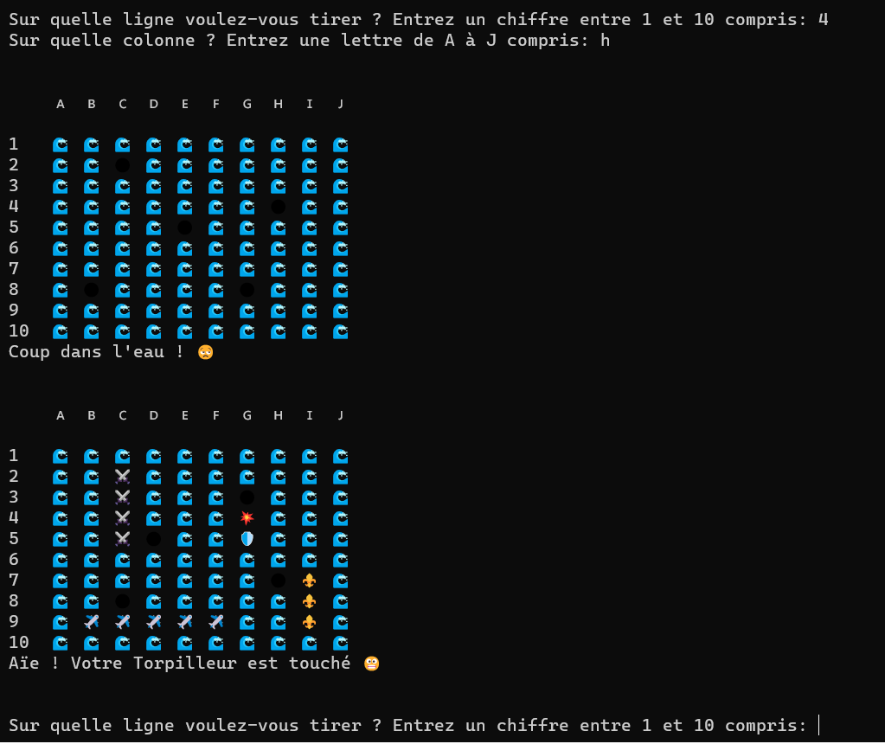
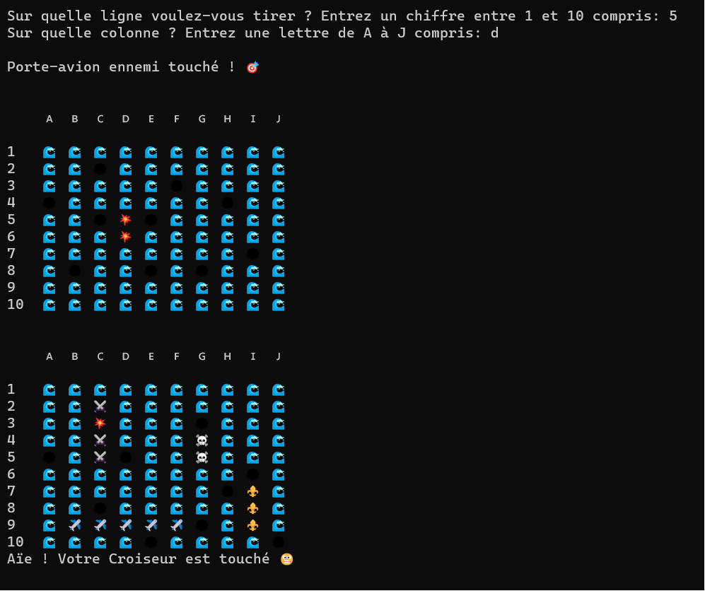
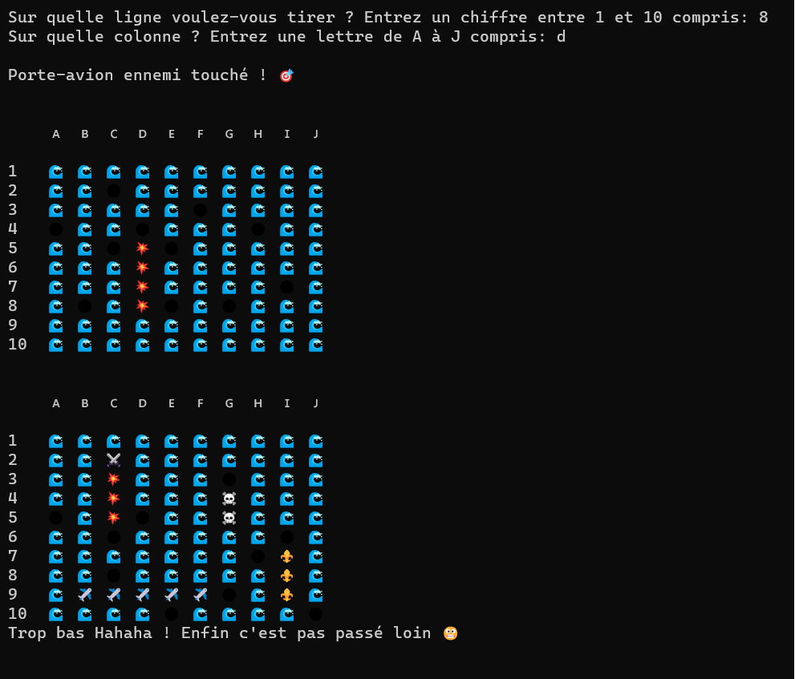
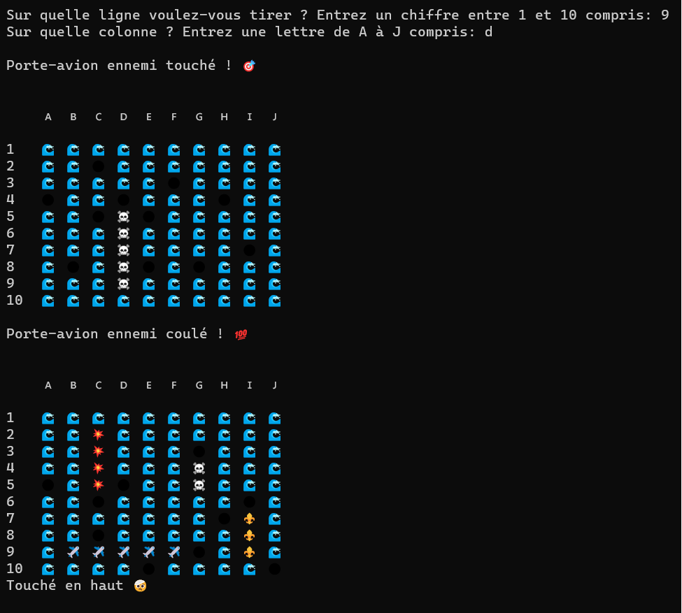

## Jeu de la bataille navale (Battleship)

Projet personnel de développement du jeu de la bataille navale en langage Python, à lancer sur le terminal.

Challenge : coder un algorythme qui joue les coups d'un joueur adverse.

Pour lancer le jeu, entrez la commande `python3 battleship.py`

Exemples:

